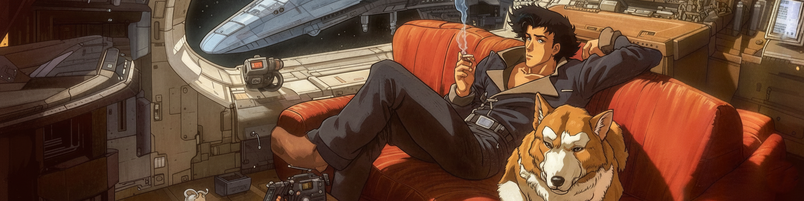
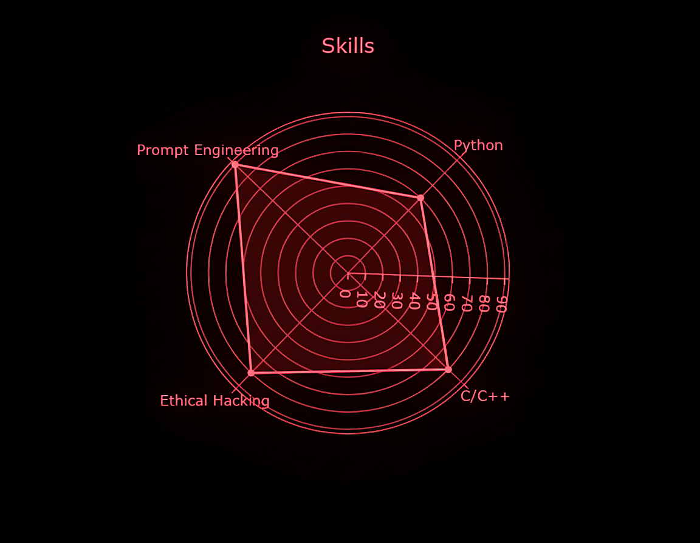
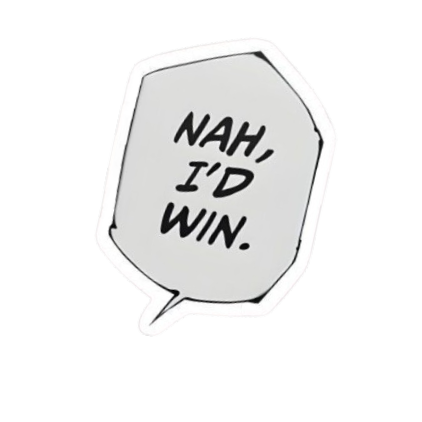

# Hi, I'm Samarth! 👋

<table>
<tr>
<td width="65%">

**Ethical Hacker | Prompt Engineer | C / C++ / Python Developer**

💻 Passionate about **cybersecurity, coding, and AI-powered solutions**.

⚡ Skilled in **ethical hacking, vulnerability analysis, and system security**.

🤖 Experienced in **prompt engineering** — designing smart AI workflows.

🔧 Strong in **low-level programming (C/C++) and automation with Python**.

🚀 Always curious, always learning, always building.

</td>

<td width="35%" align="center">

</td>
</tr>
</table>

---

I'm passionate about cybersecurity, coding, and building smart solutions using AI and programming.

---

## ⚔️ Skills

<table>
<tr>

<td width="35%" align="center">

</td>

<td width="65%">

- **Cybersecurity:** Ethical hacking, vulnerability testing, recon

- **Programming:** C · C++ · Python

- **AI / Prompting:** Prompt engineering, LLM workflow automation

- **Tools:** Scripting, static/dynamic analysis, reverse engineering

</td>

</tr>
</table>

---

<table>

<tr>

<td>

| ⚔️ Skills | 🌐 Level |
|------------------------|----------|
| Hacking | ████████░░░ 80% |
| Python | ██████░░░░░ 60% |
| C / C++ | ████░░░░░░░ 50% |
| Prompt Engineering | █████████░░ 90% |

</td>

<td>

</td>

</tr>

</table>

---

## 🚀 Projects

<table>
<tr>

<td width="60%">

### Featured Projects

- 🤖 **Buddy AI**
- ⌨️ **Keylogger**
- 🔐 **Password Manager**
- 🛡️ **Sentinel Core**
- 🖼️ **Steganography Toolkit**

</td>

<td width="40%" align="center">

</td>

</tr>
</table>

---

## 📬 Connect with Me

